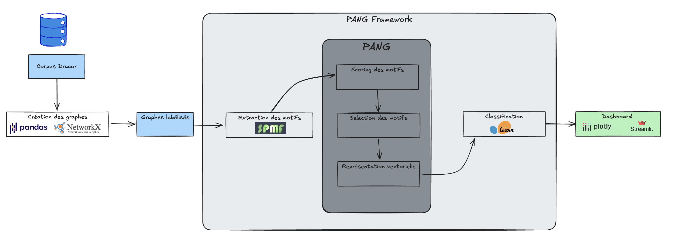
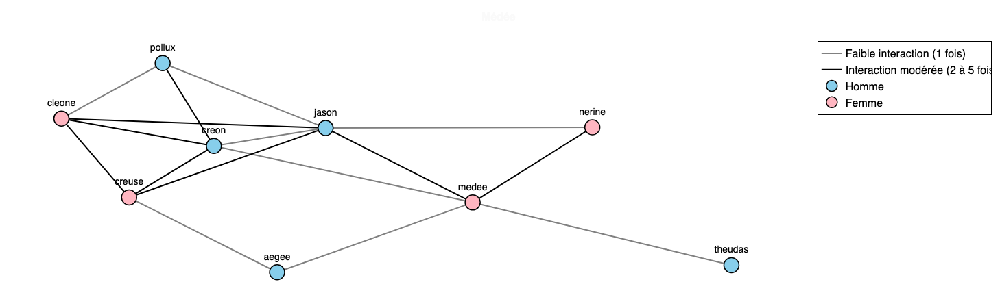

# 🎭 DramaPang – Et si le genre d’une pièce de théâtre pouvait se lire dans son réseau de personnages ?

> Une application pour explorer les réseaux de personnages dans les pièces françaises, détecter les motifs clés et prédire s’il s’agit d’une **comédie** ou d’une **tragédie**.

---

## Essayez l’application

Application déployée ici :  
👉 **[DramaPang sur Streamlit →](https://dramapang.streamlit.app/)**  

---

## Objectif du projet

**DramaPang** est un outil interactif pour explorer des graphes de personnages extraits de pièces de théâtre françaises (corpus DraCor), et les **classifier automatiquement** en comédies ou tragédies.  
Le projet s’appuie sur un pipeline complet, de la construction des graphes à la classification automatique, pour :

- Représenter chaque pièce de théâtre comme un **graphe de personnages**
- Extraire des **motifs structurants et discriminants**
- **Prédire le genre** de la pièce (Comédie / Tragédie)
- Offrir une **visualisation interprétable** des motifs clés

---

##  Schéma du pipeline

Voici l’architecture globale du projet, résumée en une image :

### 1. Construction des graphes

- Source : corpus [DraCor](https://dracor.org/)
- Un graphe par pièce :
  - **Nœuds** : personnages, labellisés par genre (`MALE`, `FEMALE`, `UNKNOWN`)
  - **Arêtes** : co-présence dans les actes (poids discrétisé)

### 2. Extraction et vectorisation des motifs

- Extraction de **sous-graphes fréquents**
- Représentation des pièces sous forme de vecteurs de motifs
- Scorage selon une mesure sélectionnée :
  - `Sup` : support
  - `AbsSupDif` : différence absolue de support
  - `WRAcc` : weighted relative accuracy

### 3. Sélection des motifs discriminants

- Clustering pour réduire la redondance
- Sélection des motifs les plus représentatifs
- Affichage interactif des **top motifs**

### 4. Classification
- Modèle : **Arbre de décision**
- Prédiction du genre (`Comédie` / `Tragédie`)

### 5. Interprétation
- Visualisation :
  - de l’arbre de décision
  - du chemin parcouru
  - des **motifs clés** ayant influencé la prédiction

---

## Données

- **400 pièces** issues du corpus DraCor :  
  - 200 comédies  
  - 200 tragédies  
- Chaque pièce est représentée comme un **graphe connexe**
- Données accessibles via [l’API DraCor](https://dracor.org/doc/api)

---

### Exemple de graphe : *Médée* (Corneille)

  
*Graphe des personnages de la tragédie **Médée**, extrait du corpus DraCor.*

- **Nœuds** :
  - `MALE` → bleu (Jason, Créon, etc.)
  - `FEMALE` → rose (Médée, Créuse, etc.)
  - `UNKNOWN` → gris (genre non précisé)

- **Arêtes** :  
  Chaque lien représente une **co-présence entre deux personnages** dans un ou plusieurs actes :
  - 1 seule co-présence → **gris**
  - 2 à 5 co-présences → **noir**
  - plus de 5 co-présences → **rouge**

---

## Stack technique

- Python : `pandas`, `networkx`, `scikit-learn`, `matplotlib`, `plotly`
- Application : `Streamlit`
- CI/CD : `GitHub Action`

---

## À propos du projet

Le projet repose sur le framework **PANG (Pattern-based Anomaly detection in Graphs)**, développé pour des cas d’usage réels lors de ma thèse, et adapté ici à un jeu de données open source.

Framework PANG : [github.com/CompNet/PANG](https://github.com/CompNet/PANG)  

---

## 👨‍💻 Auteur

Projet développé par **[Lucas Potin](https://lucaspotin98.github.io/)**  
*Data Scientist – Modélisation & Graphes*
